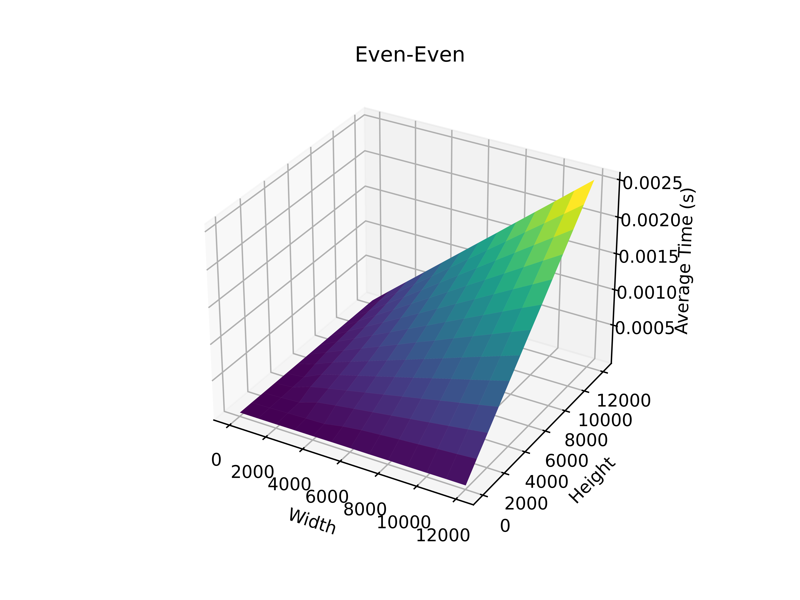

# fftshift_cuda
FFT shift library on CUDA enabled GPUs

## Description
This library is designed to mimic the MATLAB internal [fftshift](https://www.mathworks.com/help/matlab/ref/fftshift.html) function.\
This library can operate on both dimension and on each dimension individually.\
For dimensions that have an odd number of elements, it follows MATLABs logic and assignes the middle element as part of the left half of the resulting data.

## Examples
| Input        | Operation   | Result      |
|:------------:|:-----------:|:-----------:|
| \| 1, 2, 3, 4 \| \| 5, 6, 7, 8 \| | Shift Width | \| 3, 4, 1, 2 \| \| 7, 8, 5, 6 \| |
| \| 0, 1, 2, 3, 4 \| \| 5, 6, 7, 8, 9 \| | Shift Width | \| 3, 4, 0, 1, 2 \| \| 8, 9, 5, 6, 7 \| |
| \| 1, 2, 3, 4 \| \| 5, 6, 7, 8 \| | Shift Height | \| 5, 6, 7, 8 \| \| 1, 2, 3, 4 \| |
| \| 1, 2, 3 \| \| 4, 5, 6 \| \| 7, 8, 9 \| | Shift Height | \| 7, 8, 9 \| \| 1, 2, 3 \| \| 4, 5, 6 \| |
| \| 1, 2, 3, 4 \| \| 5, 6, 7, 8 \| | Shift Both | \| 7, 8, 5, 6 \| \| 3, 4, 1, 2 \| |

## Speed
Surface plot showing speed of operation of matrices with dimensions that are both even.

## License
[MIT](https://choosealicense.com/licenses/mit/)
